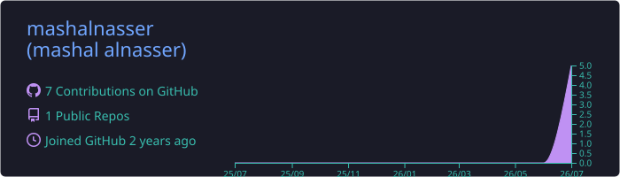
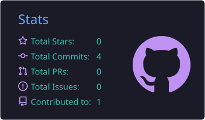
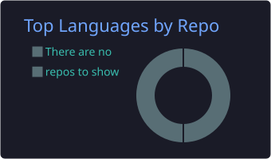
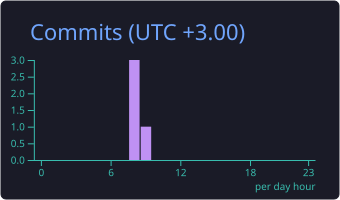

<div align="center">


<a href="https://github.com/mashalnasser">
  
</a>

<br><br>


</div>

<br>

## 🧑‍🚀 About Me

```typescript
const mashal = {
  name: "Mashal Alnasser | مشعل الناصر",
  role: "Software Engineer @ SecureHoot 💼",
  location: "Kuwait 🇰🇼",
  code: ["TypeScript", "JavaScript", "Dart"],
  building: {
    mobile: ["React Native", "Flutter", "Expo"],
    web: ["React", "Node.js"],
    backend: ["Express", "Firebase", "REST APIs"],
  },
  clientProjects: ["Factive 🚀", "Otla 🛒"], // via SecureHoot
  personalProject: "Kashkha ✨ — where elegance begins",
  currentFocus: "Shipping full-stack products end-to-end 🚀",
};
```

<br>

## 🚀 Projects

<div align="center">

<table>
<tr>
<td align="center" width="33%">
<br>
<h3>🚀 Factive</h3>
<p><em>Founded by Mohammed Almarzouq</em></p>
<p>Full-stack development via <b>SecureHoot</b> — mobile app, website, backend & admin dashboard</p>


<br><br>
</td>
<td align="center" width="33%">
<br>
<h3>🛒 Otla</h3>
<p><em>Client project</em></p>
<p>Dashboard & backend development via <b>SecureHoot</b> — admin panel and REST APIs</p>


<br><br>
</td>
<td align="center" width="33%">
<br>
<h3>✨ Kashkha</h3>
<p><em>Personal project</em></p>
<p>Bilingual React Native app — <b>where elegance begins</b>. Designed & built end-to-end</p>


<br><br>
<a href="https://github.com/mashalnasser/Kashkha"></a>
</td>
</tr>
</table>

</div>

<br>

## ⚡ Tech Arsenal

<div align="center">

<a href="#"></a>
<br>
<a href="#"></a>

</div>

<br>

## 📊 GitHub Stats

<div align="center">



<br>




<br>




<br><br>


</div>

<br>

## 🐍 Contribution Snake

<div align="center">

<picture>
  <source media="(prefers-color-scheme: dark)" srcset="https://raw.githubusercontent.com/mashalnasser/mashalnasser/output/github-snake-dark.svg" />
  <source media="(prefers-color-scheme: light)" srcset="https://raw.githubusercontent.com/mashalnasser/mashalnasser/output/github-snake.svg" />
  
</picture>

</div>

<br>

## 📈 Activity Graph

<div align="center">


</div>

<br>

## 📫 Let's Connect

<div align="center">

<a href="mailto:mmm760778@gmail.com">
  
</a>
<a href="https://github.com/mashalnasser">
  
</a>

<br><br>


</div>
